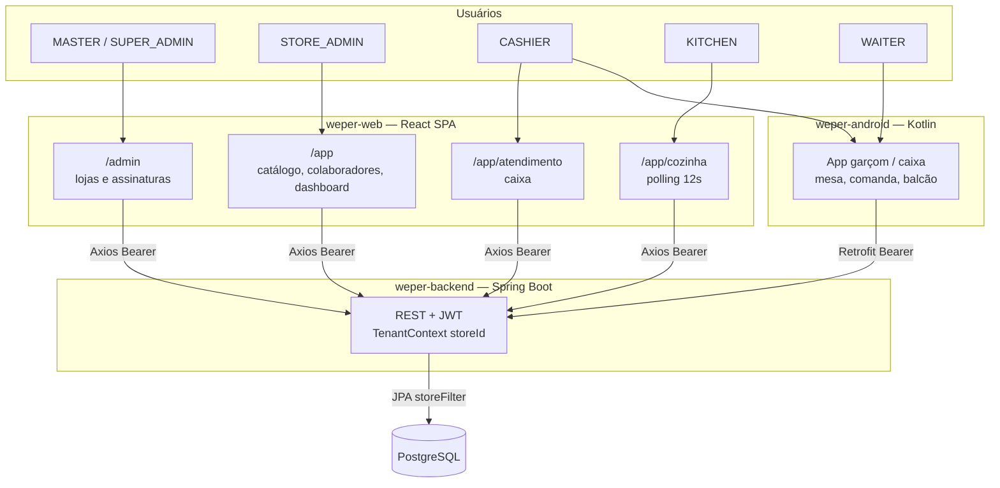
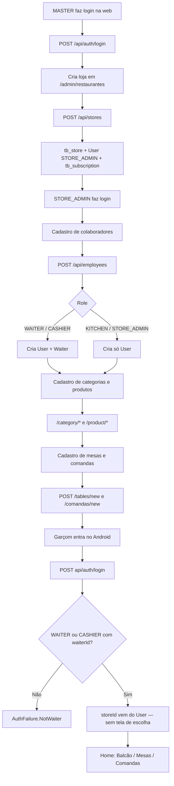
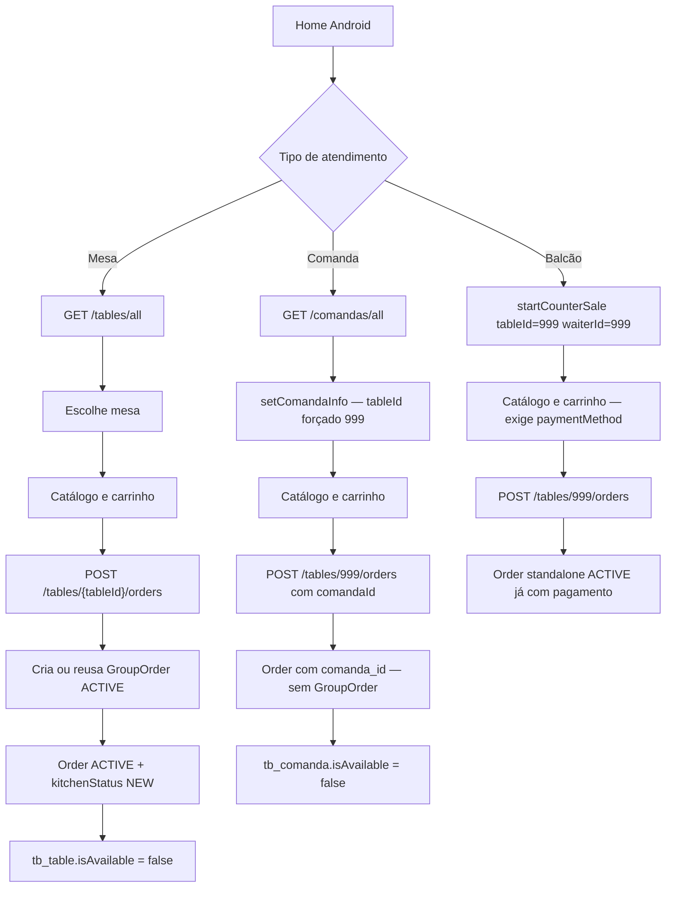
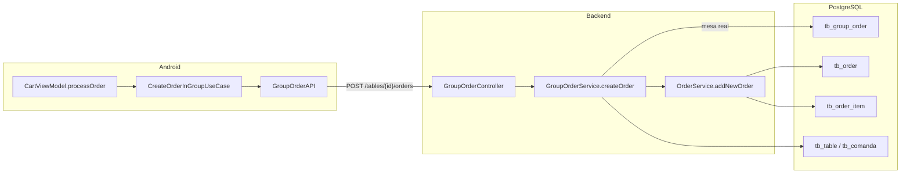
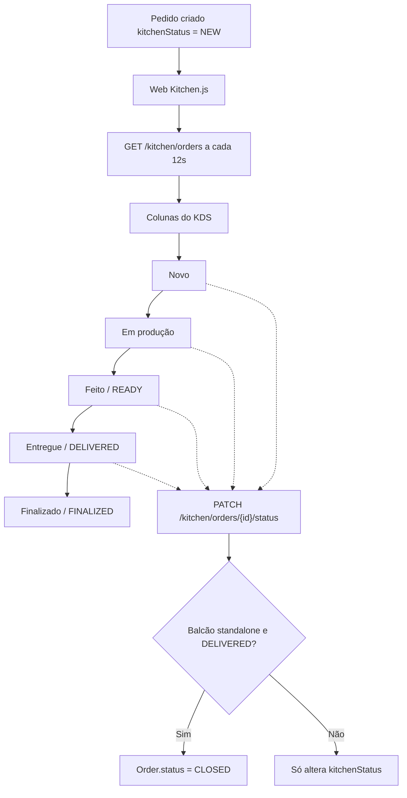
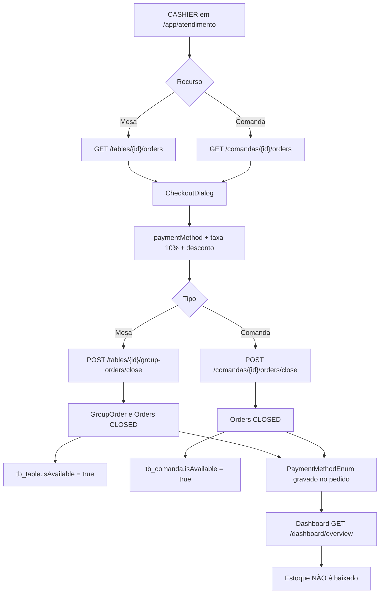
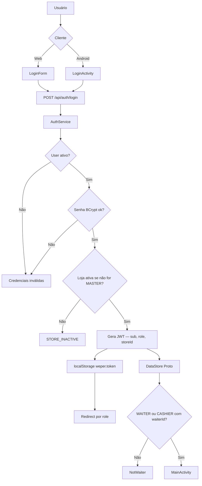
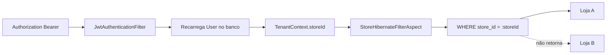
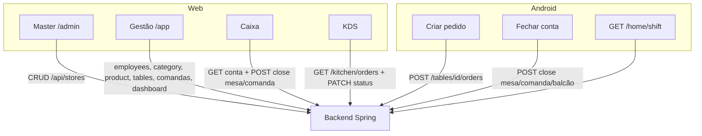

# Fluxograma do sistema Weper / Weper

Fluxos extraídos do código real (`weper-backend`, `weper-web`, `weper-android`).  
No Cursor ou no GitHub, os blocos Mermaid renderizam como diagrama.

---

## 1. Arquitetura geral

---

## 2. Jornada completa do estabelecimento

---

## 3. Atendimento — mesa, comanda e balcão

---

## 4. Pedido no backend

---

## 5. Cozinha / KDS

---

## 6. Caixa e pagamento

---

## 7. Autenticação

---

## 8. Multi-tenant

---

## 9. Quem fala com quem

