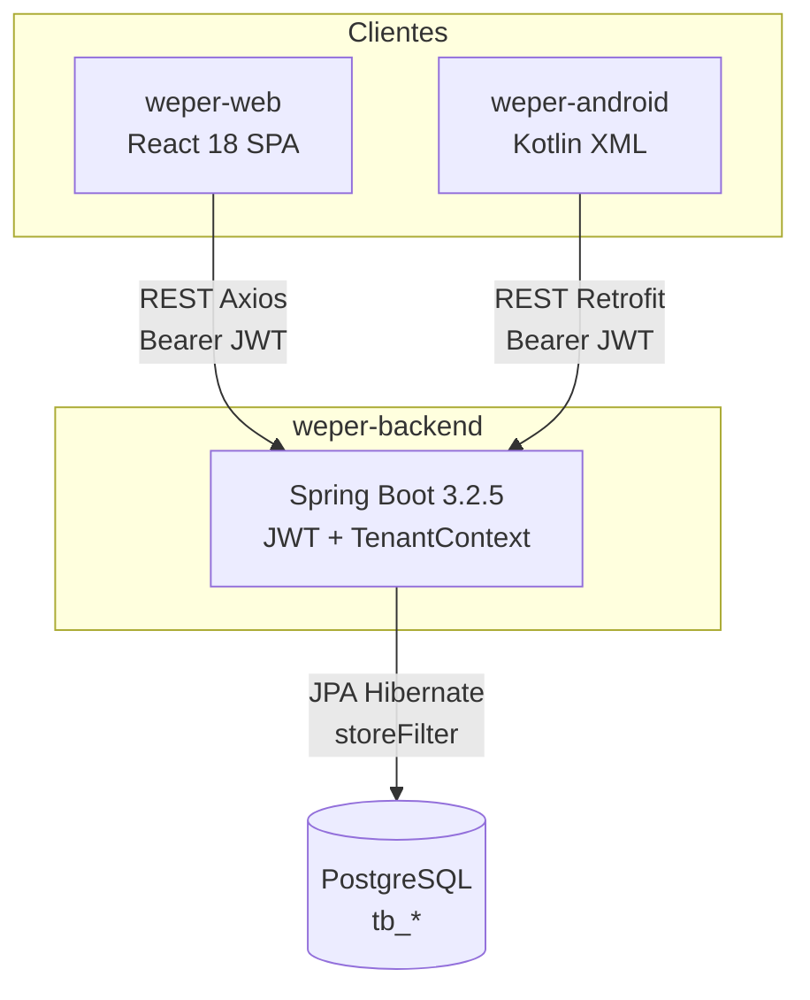

# 01 — Visão geral do sistema

Documento gerado a partir do código real dos repositórios `weper-backend`, `weper-web` e `weper-android`. Nada aqui é hipotético: nomes de classes, endpoints e tabelas correspondem ao que existe no código.

## O que é o Weper / Weper

O produto é um sistema de operação para estabelecimentos de alimentação (salão, caixa e cozinha). O display name no backend é **Weper** (`weper.solutions:weper:1.0.0`); o Android se chama **Weper Solutions**; o web README chama **Weper Web**.

Não há um quarto cliente. O KDS (cozinha) **não é um aplicativo separado**: é uma rota da SPA web (`/app/cozinha`, componente `Kitchen`).

## Stack real

| Camada | Tecnologia encontrada |
|--------|------------------------|
| Backend | Spring Boot **3.2.5**, Java **17**, Maven, JPA/Hibernate, Spring Security, JJWT 0.12.6, MapStruct 1.4.2, springdoc-openapi |
| Banco | **PostgreSQL** (`jdbc:postgresql://…/weper`). Schema via `spring.jpa.hibernate.ddl-auto=update`. **Sem Flyway/Liquibase** |
| Web | React **18.3.1**, Create React App (`react-scripts` 5), JavaScript (sem TypeScript), React Router v6, Axios, MUI 5 |
| Android | Kotlin, XML + ViewBinding (**sem Compose**), Hilt, Retrofit 2.11, Coroutines + LiveData, DataStore Proto. **Sem Room** |
| Realtime | **Não existe** WebSocket nem SSE. Há **polling de 12s** no KDS web e no badge de turno do Android |
| Integrações externas | **Nenhuma** de negócio (sem gateway de pagamento, e-mail, SMS, S3). Firebase no web está inicializado mas **não** autentica. Android usa Firebase **Crashlytics** apenas. Impressora térmica Bluetooth no Android (`DantSu` ESCPOS) |

## Quem usa o quê

```text
MASTER / SUPER_ADMIN  →  Web /admin          (painel de lojas)
STORE_ADMIN / ADMIN   →  Web /app            (gestão da loja)
CASHIER               →  Web /app/atendimento  e  Android (salão/caixa)
KITCHEN               →  Web /app/cozinha    (KDS)
WAITER                →  Android (pedido, mesa, comanda, balcão)
                      →  Web /app/garcom é apenas placeholder
```

O Android **rejeita login** se o role não for `WAITER` ou `CASHIER`, ou se `waiterId` for nulo (`AuthFailure.NotWaiter` em `AuthenticationDataSource`).

## Arquitetura geral (código real)

```text
                         ┌─────────────────────┐
                         │      USUÁRIO        │
                         └──────────┬──────────┘
                                    │
              ┌─────────────────────┴─────────────────────┐
              │                                           │
       ┌──────▼──────┐                            ┌───────▼────────┐
       │  WEB APP    │                            │  ANDROID APP   │
       │ React SPA   │                            │ Kotlin XML     │
       │             │                            │                │
       │ /admin      │                            │ Garçom/Caixa   │
       │ /app (loja) │                            │ Mesa/Comanda/  │
       │   Caixa     │                            │ Balcão + print │
       │   KDS       │                            │                │
       │   Catálogo  │                            │                │
       │   Colabor.  │                            │                │
       └──────┬──────┘                            └───────┬────────┘
              │  REST / HTTP + JWT                         │
              │  Authorization: Bearer <token>             │
              └────────────────────┬───────────────────────┘
                                   │
                          ┌────────▼────────┐
                          │    BACKEND      │
                          │  Spring Boot    │
                          │  Weper API    │
                          │  :8080          │
                          └────────┬────────┘
                                   │
                          ┌────────▼────────┐
                          │   PostgreSQL    │
                          │   database      │
                          │   weper       │
                          └─────────────────┘
```



## Como as três pontas se conectam

1. **Web e Android não conversam entre si.** Ambos falam só com o backend.
2. O tenant (`storeId`) **não** vai em header, query ou body nas listagens. Sai do `User.store` gravado no banco, recarregado a cada request pelo `JwtAuthenticationFilter`, e entra no `TenantContext` (ThreadLocal). O Hibernate aplica o filtro `storeFilter` (`store_id = :storeId`).
3. Pedidos **nascem no Android** (`POST /tables/{tableId}/orders`). A web **não chama** esse endpoint. O caixa web **consulta e fecha** contas (`GET …/orders` + `POST …/close`). O KDS web **lista e muda status** (`GET /kitchen/orders` + `PATCH /kitchen/orders/{id}/status`).
4. Catálogo, mesas, comandas e colaboradores são cadastrados na **web**. O Android **lê** categorias/produtos/mesas/comandas para montar o pedido.

## Constantes de domínio importantes

| Constante | Valor | Onde |
|-----------|-------|------|
| Mesa/balcão sentinela | `999` (`OrderService.DEFAULT_ID`, `COUNTER_TABLE_ID`) | Backend e Android. Pedido de balcão e de comanda usa `tableId=999` |
| Garçom sentinela de balcão | `999` (`COUNTER_WAITER_ID`) | Android. Backend trata `waiterId == 999` como não-mesa |
| Taxa de serviço | **10%** (`1.10`) | Backend `GroupOrderService.calculateTotal`; web `CheckoutDialog` também calcula 10% na UI |
| Polling KDS | 12 segundos | `Kitchen.js` |
| Polling turno Android | 12 segundos | `MainActivity.observeShiftBadge` → `GET /home/shift` |
| JWT validade | `app.jwt.expiration-ms` default **12h** | Sem refresh token |

## O que o sistema faz de ponta a ponta (real)

```text
MASTER cria Store (tb_store + User STORE_ADMIN + Subscription)
        ↓
STORE_ADMIN cadastra colaboradores, categorias, produtos, mesas, comandas
        ↓
WAITER/CASHIER no Android faz login → storeId vem do User, sem tela de escolha
        ↓
Garçom escolhe Mesa OU Comanda OU Balcão → monta carrinho → POST /tables/{id}/orders
        ↓
Pedido ACTIVE + kitchenStatus NEW → aparece no KDS web (polling 12s)
        ↓
Cozinha avança NEW → IN_PREPARATION → READY → DELIVERED
        ↓
Caixa web (ou Android) fecha mesa/comanda/balcão com PaymentMethodEnum
        ↓
Mesa/comanda volta a isAvailable=true
        ↓
Dashboard GET /dashboard/overview lê pedidos fechados
```

**Diferenças em relação ao fluxo “esperado” do briefing:**

- Não existe seleção de estabelecimento no Android: o usuário já pertence a uma `Store`.
- Não existe baixa de estoque na venda. `Product.quantity` é campo de cadastro; o dashboard só **alerta** quantidade entre 1 e 8.
- Não existe entidade `Payment` / tabela de pagamentos. O método é um enum gravado em `Order` e `GroupOrder` no fechamento.
- KDS não é push: é polling HTTP.
- A web não cria pedidos de atendimento.

## Documentos desta pasta

| Arquivo | Conteúdo |
|---------|----------|
| [02-backend-architecture.md](./02-backend-architecture.md) | Controllers, services, security, packages |
| [03-web-architecture.md](./03-web-architecture.md) | Rotas, services, contexts, papéis |
| [04-android-architecture.md](./04-android-architecture.md) | Telas, ViewModels, Retrofit, sessão |
| [05-authentication-flow.md](./05-authentication-flow.md) | Login JWT ponta a ponta |
| [06-multitenancy-flow.md](./06-multitenancy-flow.md) | `storeId`, filtro Hibernate, riscos |
| [07-order-flow.md](./07-order-flow.md) | Nascimento do pedido |
| [08-table-flow.md](./08-table-flow.md) | Mesa + GroupOrder |
| [09-command-flow.md](./09-command-flow.md) | Comanda |
| [10-counter-flow.md](./10-counter-flow.md) | Balcão (`tableId=999`) |
| [11-kds-flow.md](./11-kds-flow.md) | Cozinha / kitchenStatus |
| [12-payment-flow.md](./12-payment-flow.md) | Fechamento e PaymentMethodEnum |
| [13-inventory-flow.md](./13-inventory-flow.md) | Estoque (parcial / sem baixa) |
| [14-api-map.md](./14-api-map.md) | Tabela de endpoints e origem |
| [15-database-model.md](./15-database-model.md) | Entidades, tabelas, cardinalidade |
| [16-integration-map.md](./16-integration-map.md) | Dependências entre projetos |
| [17-problems-and-gaps.md](./17-problems-and-gaps.md) | Gaps classificados |
| [18-complete-system-flow.md](./18-complete-system-flow.md) | Documento principal + matriz |
