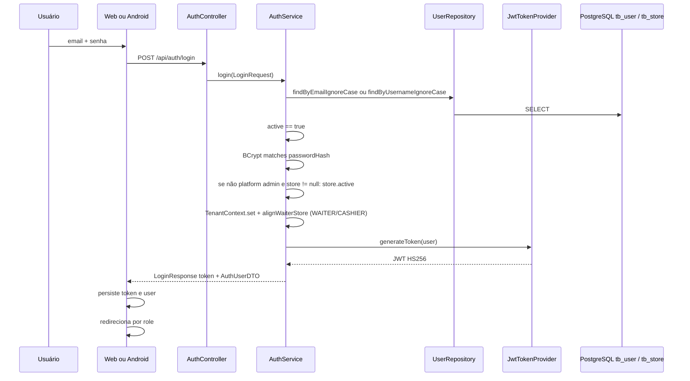

# 05 — Fluxo de autenticação

## Fluxo esperado vs real

O briefing previa: login → validar usuário → validar estabelecimento → validar permissões → JWT → armazenar → redirecionar.

O código **corresponde em grande parte**, com diferenças:

- Permissões de tela **não** são validadas no `AuthService`. O backend autentica qualquer `User` ativo com senha correta e loja ativa. O **cliente** decide o que fazer com o `role` (web: `getPostLoginPath`; Android: rejeita se não for WAITER/CASHIER com `waiterId`).
- Não há refresh token. Expiração default 12h (`JWT_EXPIRATION_MS`).
- `GET /api/auth/me` existe no backend; **nenhum cliente o chama** no fluxo normal.

## Diagrama



## Backend — passo a passo

Arquivos: `AuthController`, `AuthService`, `JwtTokenProvider`, `JwtAuthenticationFilter`.

1. `POST /api/auth/login` (público). Body `LoginRequest`: `email` **ou** `username` + `password`.
2. `AuthService.login`:
   - Credenciais vazias → `AUTH_INVALID_CREDENTIALS`
   - Usuário inexistente / inativo / senha errada → mesma mensagem (não distingue)
   - Se `user.store != null` e role não é MASTER/SUPER_ADMIN e `store.active != true` → `STORE_INACTIVE`
3. `TenantContext.set(userId, storeId, role)` só durante o login para `alignWaiterStore`:
   - Se role é floor operator (`WAITER` ou `CASHIER`), `WaiterService.ensureForUser` garante `Waiter`
   - Se `Waiter.store` ≠ `User.store`, o User é atualizado para a loja do Waiter
4. JWT claims: `sub`=userId, `username`, `role`, `storeId` (omitido se `user.store == null`), `iat`, `exp`.
5. Response `LoginResponse`: `token`, `tokenType=Bearer`, `expiresIn`, `user` (`AuthUserDTO`: id, name, username, email, role, storeId, storeName, waiterId, subscription*).

## Request autenticada

```text
Authorization: Bearer <jwt>
        ↓
JwtAuthenticationFilter
        ↓
JwtTokenProvider.parse (assinatura + exp)
        ↓
UserRepository.findByIdWithStore(sub)
        ↓
user.active?
        ↓
UserPrincipal + SecurityContext
        ↓
TenantContext.set(id, storeId do User no DB, role)
        ↓
se não platform admin e assinatura inativa → 403 SUBSCRIPTION_INACTIVE
        ↓
SecurityConfig.authorizeHttpRequests (roles)
```

O claim `storeId` do token **não** é usado para o tenant em runtime. Se o User mudar de loja no banco, o próximo request já usa a loja nova, mesmo com token antigo (até expirar).

## Web

```text
LoginForm.signIn
  → authService.login(email, password)
  → POST {API_BASE_URL}/api/auth/login
  → saveSession(token, user)   // localStorage weper.token / weper.user
  → resolveHomePath(user)      // accessControl.getPostLoginPath
```

Destinos:

| Role | Home |
|------|------|
| MASTER / SUPER_ADMIN | `/admin/dashboard` |
| ADMIN / STORE_ADMIN | `/app/dashboard` |
| CASHIER | `/app/atendimento` |
| KITCHEN | `/app/cozinha` |
| WAITER | `/app/garcom` (placeholder) |

Logout: `clearSession()`. 401 no interceptor: mesma coisa + `/login`.

## Android

```text
LoginActivity
  → LoginViewModel
  → PostAuthenticationUseCase
  → AuthenticationRepository / AuthAPI
  → POST api/auth/login
  → AuthenticationDataSource:
        role WAITER ou CASHIER E waiterId != null
        senão AuthFailure.NotWaiter
  → SessionRepository.saveUserSession (DataStore Proto)
  → MainActivity
```

Não há escolha de loja. `storeName` só aparece na toolbar.

## Autorização (não é login, mas acoplada)

Ver tabela em [02-backend-architecture.md](./02-backend-architecture.md). Pontos que divergem da intuição:

- WAITER **pode** PATCH status de cozinha, mas **não** GET `/kitchen/**` (SecurityConfig: GET kitchen só KITCHEN + admins).
- WAITER/CASHIER **podem** fechar mesa/comanda/balcão no backend; a web de caixa também.

## O que não existe

- Refresh token / sliding session
- OAuth/Google (UI morta no web)
- Forgot password API (web e Android são stubs)
- Registro self-service (Android `RegisterActivity` fora do Manifest; web não tem)
- 2FA
- `GET /api/auth/me` no fluxo dos clientes
