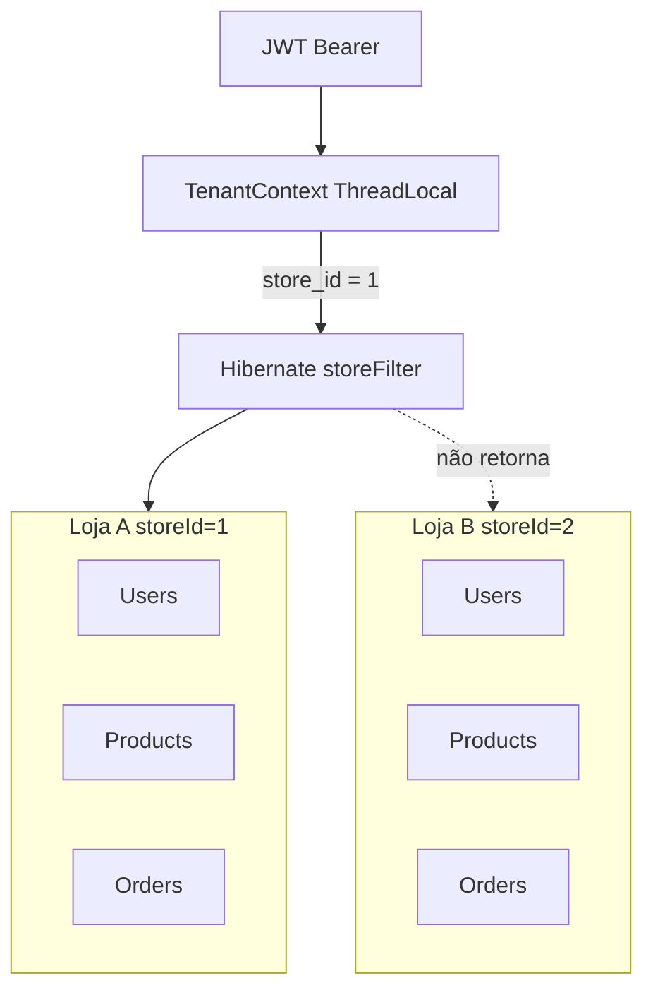

# 06 — Multi-tenancy

O identificador de tenant no código é **`storeId`** (`store_id` nas tabelas). Não existem `tenantId`, `establishmentId` nem `restaurantId` no backend. Na web, `getRestaurantId(user)` é um alias de `user.storeId`.

## Como o storeId é definido

```text
User.store  (ManyToOne em tb_user.store_id)
        ↓
Login: AuthUserDTO.storeId  +  JWT claim storeId (informativo)
        ↓
Cada request: JwtAuthenticationFilter recarrega User.findByIdWithStore
        ↓
TenantContext.set(userId, principal.getStoreId(), role)
        ↓
StoreHibernateFilterAspect ativa storeFilter nas *Service
        ↓
SQL: store_id = :storeId
```

**Não** chega por:

- header (`X-Store-Id` etc.)
- path `/stores/{id}/products`
- query `?storeId=`
- body nas operações da loja (o service faz `TenantContext.storeRef()` ao persistir)

MASTER/SUPER_ADMIN tipicamente têm `User.store == null` → `storeId` nulo → filtro Hibernate **não** é ligado nesses services de loja (early return no aspect se role é platform admin).

## Camadas de isolamento

1. **JWT + User no banco** — o usuário pertence a no máximo uma loja.
2. **`TenantContext`** — ThreadLocal por request; `clear()` no `finally` do filtro.
3. **`StoreHibernateFilterAspect`** — `@Around` em `*Service.*` exceto:
   - package `auth`
   - `StoreService`
   - `SubscriptionService`
   - `WaiterService.ensureForUser`
4. **`@Filter(name = "storeFilter")`** nas entidades com `store_id`.
5. **`StoreAccess.owned`** — se `TenantContext.getStoreId() != null`, exige `entity.store.id` igual; senão **retorna sem checar**.
6. **Queries explícitas** `existsByIdAndStore_Id` em `OrderService` (produto, categoria, mesa, waiter, comanda).

## Entidades com filtro Hibernate

| Entidade | Filtro |
|----------|--------|
| `Category`, `Product`, `ProductExtra`, `MandatoryGroup` | sim |
| `Table`, `Comanda`, `Waiter`, `Order`, `GroupOrder` | sim |
| `Store` | só `@FilterDef` (definição), não se filtra a si |
| `User` | **não** tem `@Filter` |
| `Subscription` | **não** |
| `MandatoryItem`, `OrderItem`, `OrderProductExtra`, `OrderMandatorySelection` | **não** (filhos; sem `store_id`) |

## Cadastro de loja (origem do tenant)

Só MASTER/SUPER_ADMIN, `POST /api/stores`.

```text
MasterDashboard (web /admin/restaurantes)
  → storesService.createStore
  → POST /api/stores
  → StoreController
  → StoreService.createStore
      → tb_store (active=true, slug único)
      → tb_user  (role STORE_ADMIN, store_id da loja nova)
      → SubscriptionService.createForStore → tb_subscription
```

O admin da loja passa a ter `storeId` no próximo login. Colaboradores criados depois herdam `TenantContext.storeRef()`.

## Diagrama



## Riscos encontrados no código

### CRÍTICO — MASTER/SUPER_ADMIN sem store enxergam todas as lojas

Se um platform admin chamar endpoints de loja (`GET /product/all`, `GET /order/all`, `GET /kitchen/orders`…), o aspect **não ativa o filtro**. Não há `storeId` obrigatório nessas APIs. Na prática a web master **não monta** essas telas (`ROLE_ROUTES` só `/admin/*`), mas a API em si permite.

`StoreAccess.assertOwned` com `storeId == null` dá `return` imediato — não bloqueia.

### ALTO — User sem filtro Hibernate

Isolamento de funcionários depende de `EmployeeService.requireStoreEmployee` / `findByStore_Id`. Um endpoint genérico de User (não há hoje além de employees) seria perigoso. `WaiterController` lista waiters via service com filtro.

### ALTO — Filhos sem `store_id`

`OrderItem`, `OrderProductExtra`, `OrderMandatorySelection`, `MandatoryItem` não têm tenant próprio. Segurança depende de só acessá-los via `Order`/`MandatoryGroup` já filtrados. Não há controller direto para `OrderItem`.

### MÉDIO — Queries nativas

`ProductRepository` tem SQL nativo (`DELETE FROM order_product…`) que **ignora** filtro Hibernate.

### MÉDIO — `CategoryRepository.existsByName(String)` sem store

Método existe; o service atual parece usar constraint `(store_id, name)`. Risco latente se alguém passar a usar o método.

### MÉDIO — Matching de comanda por nome

`ComandaAccountService.matchesComanda` também associa pedido de balcão se `customerName` contém `"comanda"` e o número. Pedidos de lojas diferentes ainda passam pelo filtro de `Order`, mas o matching textual é frágil **dentro** da mesma loja.

### BAIXO — Claim JWT storeId vs DB

Token antigo continua válido até `exp`; o store efetivo é o do banco. Se um usuário for movido de loja, o token não precisa ser reemitido. Se a intenção for “token amarra a loja”, isso não acontece.

## Conclusão sobre “Loja A acessa Loja B”

Para um `STORE_ADMIN` / `WAITER` / `CASHIER` / `KITCHEN` **com** `storeId` preenchido, o caminho feliz (filtro + `existsByIdAndStore_Id` + `StoreAccess`) impede listar/criar recursos da outra loja **nas entidades filtradas**.

O furo estrutural é o **platform admin sem store** e entidades filhas sem `store_id`. Um usuário de loja A **não** escolhe a loja B no cliente: o Android/Web nem enviam `storeId`. O isolamento de operadores de chão é razoável; o de platform admin contra dados de loja **não** está no SecurityConfig além de bloquear `/api/stores` ao contrário (só master acessa stores; master acessa o resto autenticado).
