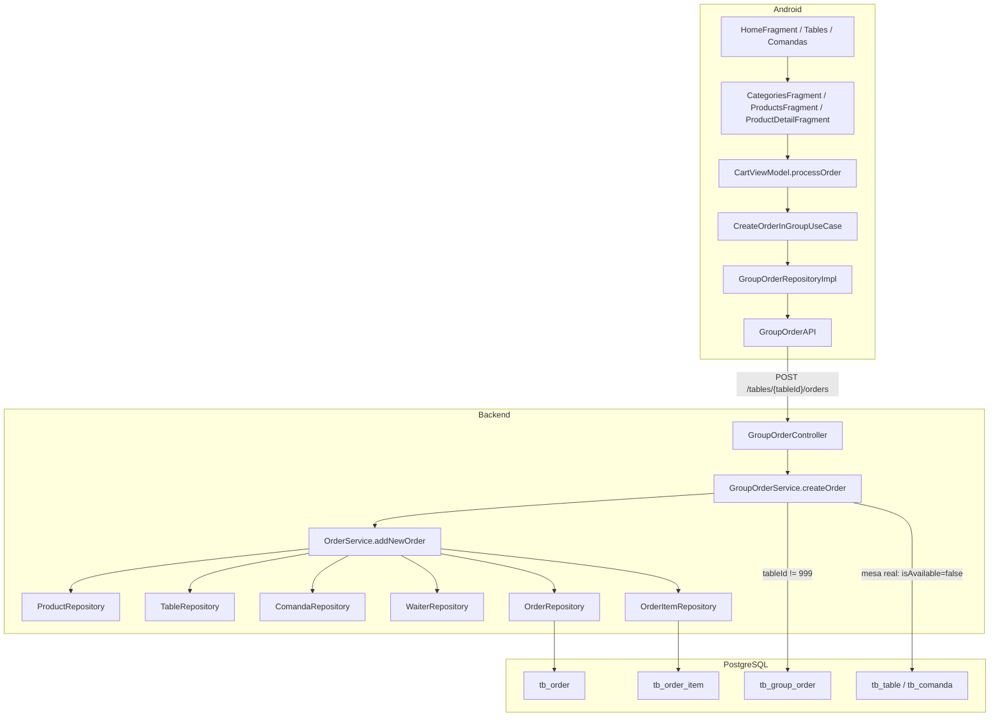

# 07 — Fluxo de pedido

Este é o fluxo principal de atendimento. O briefing descrevia Android → validações → cria pedido/itens → atualiza mesa/comanda → **atualiza estoque** → KDS/caixa.

## O que o código realmente faz

- Criação: **somente** `POST /tables/{tableId}/orders` (`GroupOrderController` → `GroupOrderService.createOrder` → `OrderService.addNewOrder`).
- `POST /order/new` está `@Deprecated` e **lança** `ORDER_ENDPOINT_DEPRECATED`.
- A **web não cria pedidos**.
- Estoque **não** é decrementado.
- Preço: o backend **recalcula** subtotal a partir de `Product` + extras no servidor (`calculateOpenSubtotal`); o `value` enviado no DTO do Android não é a fonte da verdade no fechamento.

## Diagrama ponta a ponta (classes reais)

## Três origens, um endpoint

| Origem | `tableId` na URL | Body relevante | GroupOrder? |
|--------|------------------|----------------|-------------|
| Mesa | id real da `Table` | `waiterId`, `products`, `customerName` | Sim: reusa ou cria `GroupOrder` ACTIVE |
| Comanda | **999** | `comandaId`, `waiterId`, `products` | Não. `Order.comanda` preenchido |
| Balcão | **999** | `paymentMethod` obrigatório, `waiterId` frequentemente 999 | Não. Pedido standalone |

Decisão em `GroupOrderService.createOrder`: `tableId == OrderService.DEFAULT_ID` (999) → não cria `GroupOrder`, chama `orderService.addNewOrder(orderDTO)` direto.

## Validações em `OrderService.addNewOrder`

1. `customerName` obrigatório
2. `products` não vazio
3. `TenantContext.requireStoreId()`
4. Cada produto: `productRepository.existsByIdAndStore_Id`
5. `OrderMandatoryValidationService.validateMandatorySelections`
6. Categoria, se enviada: `existsByIdAndStore_Id`
7. `tableId` e `waiterId` obrigatórios no DTO
8. Se venda de balcão (`isCounterSale`: sem `comandaId` e tableId nulo ou 999): `paymentMethod` obrigatório
9. Se mesa real (`tableId != 999 && waiterId != 999`): mesa e waiter da loja
10. Se `comandaId`: comanda da loja; marca `Comanda.isAvailable=false`

Persistência:

- `Order`: `store`, `kitchenStatus=NEW`, `status=ACTIVE`, `isFromTable`, produtos ManyToMany `order_product`
- `persistOrderItems` → `tb_order_item` (snapshot `productName`, `unitPrice`, `quantity`)
- `OrderProductExtra`, `OrderMandatorySelection`
- Balcão: já grava `totalAmount` e `paymentMethod` na criação (o pedido **continua ACTIVE** até close ou até KDS `DELIVERED` em standalone)

## Depois da criação, quem vê o pedido

| Superfície | Como |
|------------|------|
| KDS web | `GET /kitchen/orders` (polling 12s) — ACTIVE + FINALIZED 24h |
| Caixa web mesa | `GET /tables/{id}/orders` |
| Caixa web comanda | `GET /comandas/{id}/orders` |
| Android turno | `GET /home/shift` (polling 12s) |
| Android lista | `GET /order/all` |
| Dashboard loja | `GET /dashboard/overview` |

## O que o briefing previa e **não** acontece na criação

| Esperado | Real |
|----------|------|
| Atualiza estoque | Não |
| Fecha atendimento | Não (exceto total já calculado no balcão) |
| Push para KDS | Não; KDS puxa via HTTP |
| Web monta pedido | Não |

Fluxos de mesa, comanda e balcão em separado: [08](./08-table-flow.md), [09](./09-command-flow.md), [10](./10-counter-flow.md).
