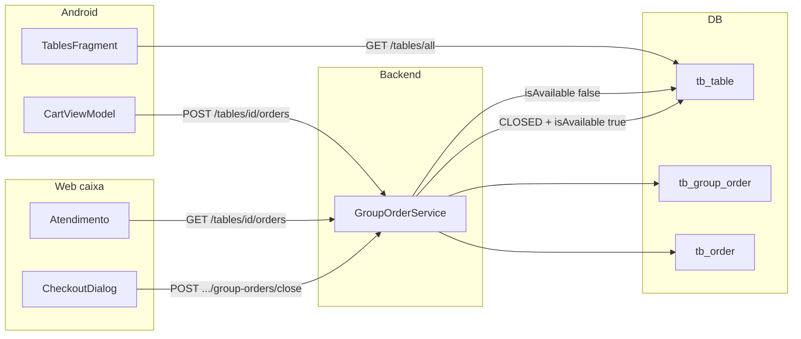

# 08 — Fluxo de mesa

## Modelo

- Entidade `Table` → `tb_table` (`number`, `isAvailable`, `capacity`, `isCounter`, `deleted`, `store_id`)
- Conta da mesa: entidade `GroupOrder` → `tb_group_order` (`status` ACTIVE/CLOSED, `totalAmount`, `paymentMethod`, `applyServiceTax`, `discount`, `table_id`, `store_id`)
- Vários `Order` apontam para o mesmo `GroupOrder` (`group_order_id`)

Não existe “selecionar mesa no login”. A mesa é escolhida **depois**, no salão.

## Cadastro de mesas

```text
WEB Atendimento / Tables
  → tablesService
  → GET /tables/all          TableController / TableService
  → POST /tables/new         roles admin
  → DELETE /tables/delete?tableId=
```

Android só **lista**: `TablesAPI GET tables/all`. Não cria mesa.

## Abrir mesa e lançar pedido

```text
Android TablesFragment
  → GET /tables/all
  → usuário escolhe mesa
  → CartViewModel.setTableInfo(tableId, waiterId)
  → catálogo → CartViewModel.processOrder
  → POST /tables/{tableId}/orders
  → GroupOrderService.createOrder
       se não existe GroupOrder ACTIVE da mesa: cria
       OrderService.addNewOrder(dto, groupOrder)
       table.isAvailable = false
```

Pedidos seguintes na **mesma mesa** entram no mesmo `GroupOrder` ACTIVE (`findActiveByTableId`).

## Consultar conta

| Cliente | Endpoint |
|---------|----------|
| Web caixa | `GET /tables/{tableId}/orders` → `GroupOrderDTO` |
| Android | mesmo, via `TablesAPI` / `GroupOrderAPI` |

Se `tableId=999`, o backend **não** trata como mesa: devolve pedidos de balcão (`findAllCounterOrders`). Ver [10-counter-flow.md](./10-counter-flow.md).

## Fechar mesa

```text
WEB CheckoutDialog  ou  Android PaymentMethodDialog
  → POST /tables/{tableId}/group-orders/close
  → body CloseGroupOrderRequest { paymentMethod, applyServiceTax, discount }
  → GroupOrderService.closeActiveGroupOrder
```

Efeitos:

1. Recusa se `tableId==999` (`COUNTER_GROUP_ORDER_CLOSE_NOT_ALLOWED`)
2. Exige `paymentMethod`
3. Recusa se já CLOSED
4. Calcula total (soma subtotais dos orders; ×1.10 se taxa; menos desconto)
5. `GroupOrder.status=CLOSED`, `closedAt`, `paymentMethod`, `totalAmount`
6. Cada `Order` ainda ACTIVE → `CLOSED`, mesmo `paymentMethod`/`discount`/`applyServiceTax`
7. `table.isAvailable = true`

**Não** altera `kitchenStatus`. **Não** mexe em `Product.quantity`.

## Diagrama



## Status da mesa vs status do pedido

| Campo | Valores | Quando |
|-------|---------|--------|
| `Table.isAvailable` | true/false | false no primeiro pedido da mesa; true no close do GroupOrder |
| `GroupOrder.status` | ACTIVE, CLOSED | um ACTIVE por mesa |
| `Order.status` | ACTIVE, CLOSED | CLOSED no fechamento da conta |
| `Order.kitchenStatus` | NEW … FINALIZED | independente do close da mesa |
