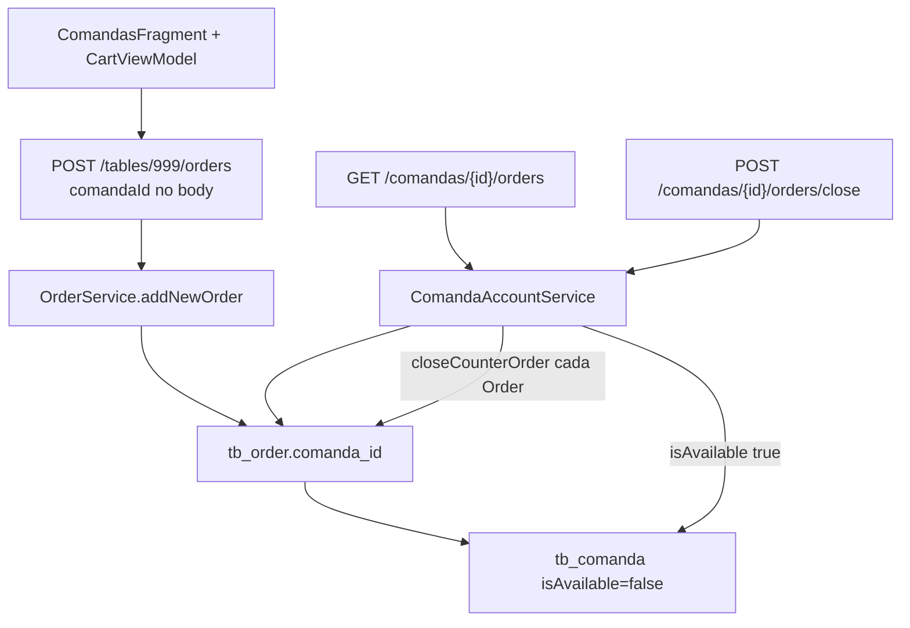

# 09 — Fluxo de comanda

## Modelo

- Entidade `Comanda` → `tb_comanda` (`number`, `isAvailable`, `deleted`, `store_id`)
- **Não existe** `GroupOrder` de comanda. A “conta” é uma agregação em `ComandaAccountService` que devolve um `GroupOrderDTO` sintético (`groupOrderId=null`, `tableId=null`).
- Pedidos de comanda são `Order` com `comanda_id` preenchido, criados pela rota de **mesa 999**.

## Cadastro

```text
WEB Atendimento / Comandas
  → comandasService
  → GET /comandas/all
  → POST /comandas/new        admin
  → DELETE /comandas/delete?comandaId=
```

Android só lista: `ComandasAPI GET comandas/all`.

## Lançar itens na comanda (Android)

```text
ComandasFragment
  → CartViewModel.setComandaInfo(comandaId, comandaNumber)
       currentTableId = 999
  → processOrder
       finalTableId = 999
       body.comandaId = comandaId
       customerName default "Comanda {number}"
       paymentMethod = null
  → POST /tables/999/orders
  → GroupOrderService: ramo isCounter (999) → OrderService.addNewOrder
  → Order.comanda setado; Comanda.isAvailable = false
```

Isso **não** é venda de balcão (`isCounterSale` retorna false se `comandaId != null`), portanto **não** exige `paymentMethod` na criação.

## Consultar conta

```text
GET /comandas/{comandaId}/orders
  → ComandaOrderController
  → ComandaAccountService.getOpenAccount
  → findActiveByComandaId
  → também varre findActiveCounterOrders e matchesComanda
       (customerName contém "comanda" e o número)
```

Web: `accountService.getComandaAccount`. Android: `ComandasAPI.getGroupOrderByComanda`.

## Fechar comanda

```text
POST /comandas/{comandaId}/orders/close
  body CloseCounterOrderRequest { paymentMethod, applyServiceTax, discount }
  → ComandaAccountService.closeOpenAccount
  → para cada order aberto: OrderService.closeCounterOrder
  → comanda.isAvailable = true
```

`closeCounterOrder` recusa pedido `isFromTable==true` (mesa). Comanda e balcão passam.

## Diagrama



## Diferença vs briefing

O briefing tratava comanda como irmã da mesa (tenant → commands → orders). No código:

- Comanda **não** gera `tb_group_order`
- Criação **reusa** o endpoint de mesa com sentinela 999
- Há matching extra por **texto** do `customerName` (`matchesComanda`) — frágil se dois nomes colidirem na mesma loja
