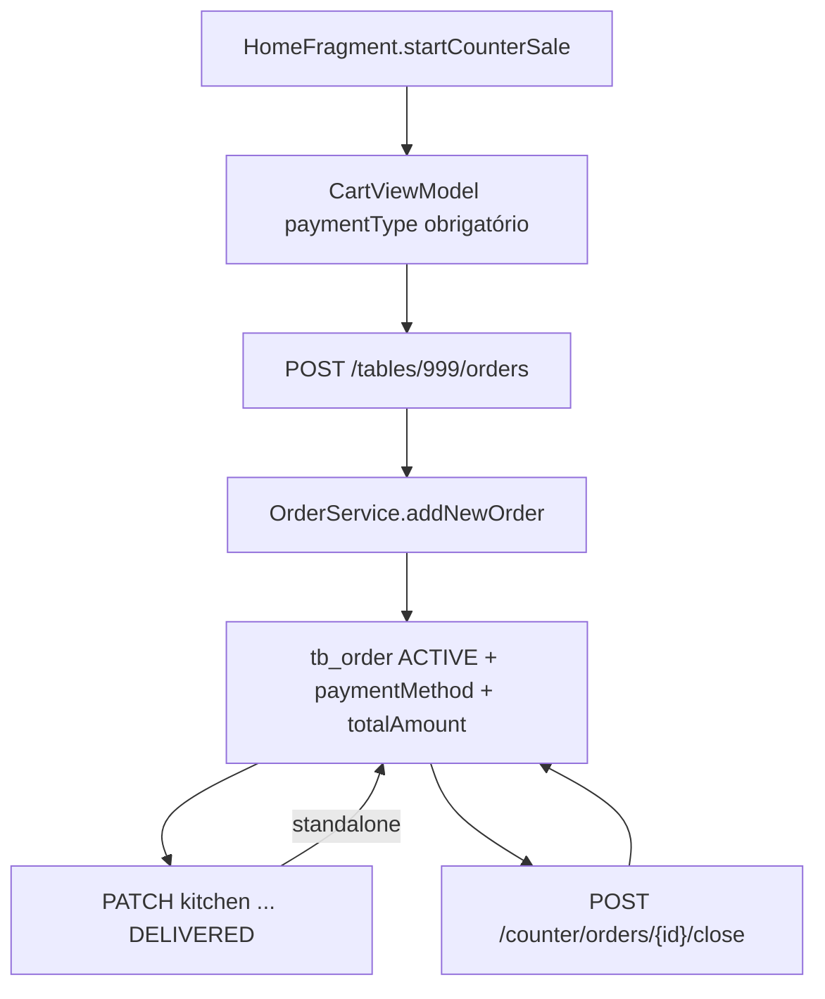

# 10 — Fluxo de balcão

Balcão no código é o sentinela **`tableId = 999`** (`OrderService.DEFAULT_ID`, Android `COUNTER_TABLE_ID`). Não é uma linha real em `tb_table` obrigatória para o fluxo (o Android nem busca mesa 999).

Há também `Table.isCounter` na entidade, usado no cadastro de mesas, **não** no caminho `createOrder` de 999.

## Início no Android

```text
HomeFragment card BALCÃO
  → cartViewModel.startCounterSale()
       tableId = 999
       waiterId = 999
       comandaId = null
  → CategoriesFragment → … → Cart
  → processOrder exige paymentType
  → POST /tables/999/orders
       paymentMethod no body
       fromTable = false
```

`GroupOrderService.createOrder` entra no ramo `isCounter` e **não** cria `GroupOrder`.

`OrderService.isCounterSale`: `comandaId == null` e (`tableId == null` ou `== 999`). Exige `paymentMethod`. Grava `totalAmount` já na criação; `status` permanece **ACTIVE**.

## Fechar pedido de balcão

Dois caminhos:

### A — Endpoint dedicado (Android `CloseCounterOrderUseCase`)

```text
POST /counter/orders/{orderId}/close
  → CounterOrderController
  → OrderService.closeCounterOrder
  → status CLOSED, paymentMethod, total, closedAt
```

### B — KDS marca DELIVERED em pedido standalone

`KitchenService.updateKitchenStatus`: se `next == DELIVERED` e `OrderService.isStandaloneCounter(order)` (`!isFromTable && comanda == null`), fecha o `Order` automaticamente (`status=CLOSED`).

A web de atendimento (`accountService`) **não** chama `/counter/orders/{id}/close`. O caixa web opera mesas e comandas. Pedido de balcão aparece no KDS e em `GET /order/all` / `GET /tables/999/orders` (lista de counter orders).

## GET `/tables/999/orders`

`GroupOrderService.getActiveGroupOrder(999)` monta um `GroupOrderDTO` sintético com `findAllCounterOrders()`, `groupOrderId=null`, `tableId=999`.

Fechar via `POST /tables/999/group-orders/close` é **recusado** (`COUNTER_GROUP_ORDER_CLOSE_NOT_ALLOWED`).

## Diagrama



## Comparação mesa / comanda / balcão

| | Mesa | Comanda | Balcão |
|--|------|---------|--------|
| URL create | `/tables/{idReal}/orders` | `/tables/999/orders` | `/tables/999/orders` |
| GroupOrder | sim | não | não |
| Pagamento na criação | não | não | **sim** |
| Close | `/tables/{id}/group-orders/close` | `/comandas/{id}/orders/close` | `/counter/orders/{id}/close` ou KDS DELIVERED |
| Libera recurso | `Table.isAvailable=true` | `Comanda.isAvailable=true` | nenhum recurso de salão |
