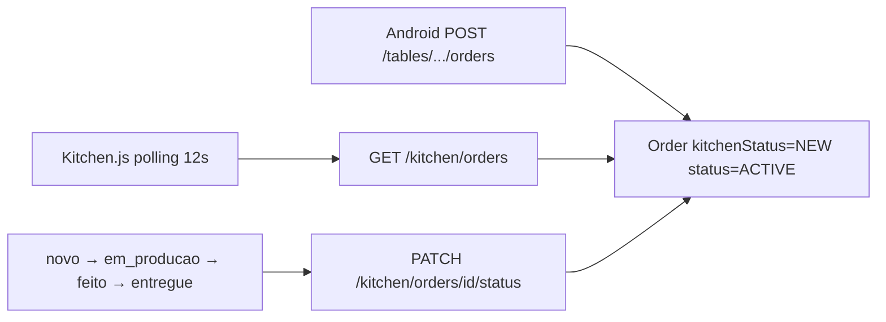

# 11 — Fluxo da cozinha / KDS

O KDS **não é um app separado**. É a rota web `/app/cozinha` (`Kitchen.js`), permitida a `KITCHEN`, `ADMIN` e `STORE_ADMIN`.

## Como o KDS obtém pedidos

**Polling HTTP a cada 12 segundos** + refresh manual. Sem WebSocket, SSE ou push.

```text
Kitchen.js
  setInterval(loadOrders, 12000)
  → kitchenService.getKitchenOrders()
  → GET /kitchen/orders
  → KitchenController
  → KitchenService.listActiveKitchenOrders
       OrderRepository.findActiveOrdersForKitchen
       + findFinalizedKitchenOrders(now - 24h)
```

Security: `GET /kitchen/**` exige role KITCHEN ou admins. **WAITER não lista o KDS**, embora possa PATCH status.

## Status reais (`KitchenStatus`)

```text
NEW → IN_PREPARATION → READY → DELIVERED → FINALIZED
```

Enum backend: `NEW`, `IN_PREPARATION`, `READY`, `DELIVERED`, `FINALIZED`.

Mapeamento na UI web (`Kitchen.js`):

| UI | Enum |
|----|------|
| `novo` | NEW |
| `em_producao` | IN_PREPARATION |
| `feito` | READY |
| `entregue` | DELIVERED |
| `finalizado` (coluna opcional; FINALIZED também cai em `entregue` no mapa inverso) | FINALIZED / DELIVERED |

Mudança:

```text
PATCH /kitchen/orders/{orderId}/status
  body KitchenStatusRequest { kitchenStatus }
  → KitchenService.updateKitchenStatus
  → StoreAccess.owned(order)
  → recusa se Order.status == CLOSED
  → setKitchenStatus
  → se READY | DELIVERED | FINALIZED e kitchenReadyAt null → agora
  → se DELIVERED e isStandaloneCounter → Order.status = CLOSED
```

Não há máquina de estados rígida: o service aceita qualquer valor do enum (`valueOf`), sem impedir pular etapas ou voltar.

## Android e cozinha

Não há tela KDS. O garçom:

- Vê pedidos prontos via `GET /home/shift` (polling 12s em `MainActivity` → `ShiftAttentionStore` alerta sonoro/vibração)
- Pode `UpdateKitchenStatusUseCase` → `KitchenAPI PATCH /kitchen/orders/{id}/status` a partir de `GroupOrderViewModel`

## Diagrama



## Relação com fechamento de conta

Fechar mesa/comanda **não** muda `kitchenStatus`. Um pedido pode estar `Order.status=CLOSED` (pago) e ainda `kitchenStatus=IN_PREPARATION`, ou o inverso (pronto na cozinha, conta aberta).

Exceção: balcão standalone em `DELIVERED` fecha o `Order` automaticamente.

Pedido já `CLOSED` **não** aceita mais PATCH de cozinha (`COUNTER_ORDER_ALREADY_CLOSED`).
