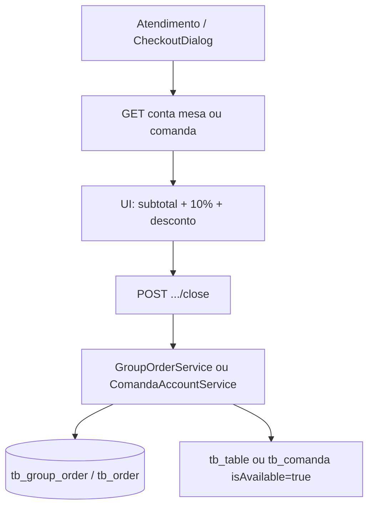

# 12 — Fluxo de pagamento / caixa

Não existe entidade `Payment`, tabela `tb_payment` nem integração com PSP. Pagamento = enum `PaymentMethodEnum` gravado em `Order` e/ou `GroupOrder` no **fechamento**.

Valores: `PIX`, `DEBIT`, `CREDIT`, `CASH`, `VOUCHER`, `OTHER`.

## Quem cobra

| Papel | Superfície | O que fecha |
|-------|------------|-------------|
| CASHIER / STORE_ADMIN | Web `/app/atendimento` + `CheckoutDialog` | Mesa e comanda |
| WAITER / CASHIER | Android `PaymentMethodDialog` + `GroupOrderViewModel` | Mesa, comanda, balcão |

A web **não** fecha pedido de balcão (`/counter/orders/{id}/close`).

## Caixa web — passo a passo

```text
Atendimento
  → lista mesas (tablesService GET /tables/all)
  → lista comandas (comandasService GET /comandas/all)
  → ao abrir conta:
       GET /tables/{id}/orders   ou   GET /comandas/{id}/orders
  → CheckoutDialog
       calcula subtotal na UI
       taxa 10% se applyServiceTax (subtotal * 0.1 no frontend)
       discount
       paymentMethod
  → POST /tables/{id}/group-orders/close
    ou POST /comandas/{id}/orders/close
```

O backend **recalcula** o total (`× 1.10` se taxa, menos desconto, floor em 0, scale 2). A taxa no frontend é espelho visual, não a fonte da persistência.

## Android

Mesmos endpoints de close, body `PaymentRequest`. Balcão: pagamento já na **criação** (`paymentMethod` no `OrderCreateRequest`) e close posterior via `POST /counter/orders/{id}/close`.

Marks locais “pago” (`WaiterOrderMarks`) **não** persistem pagamento no servidor.

## O que o fechamento grava

Mesa (`GroupOrderService.closeActiveGroupOrder`):

- `tb_group_order`: status CLOSED, paymentMethod, totalAmount, applyServiceTax, discount, closedAt
- cada `tb_order` do grupo: CLOSED, mesmos campos de pagamento, `totalAmount` = subtotal aberto do pedido (sem rateio da taxa no item — taxa está no group)
- `tb_table.isAvailable = true`

Comanda / balcão (`OrderService.closeCounterOrder`):

- um `tb_order`: CLOSED, paymentMethod, total com taxa/desconto aplicados naquele pedido
- comanda: `isAvailable = true` (no `ComandaAccountService`, depois do loop)

## Estoque e dashboard

Fechar conta **não** baixa estoque. O dashboard (`GET /dashboard/overview`) lê pedidos/fechamentos para faturamento e operação.

## Diagrama



## Gaps vs briefing

| Esperado | Real |
|----------|------|
| Pagamento salvo como registro próprio | Enum no pedido/grupo |
| Estoque no pagamento | Não |
| Gateway PIX/cartão | Não |
| Split / múltiplos meios na mesma conta | Um `paymentMethod` por close |
| Estorno | Não há endpoint |
