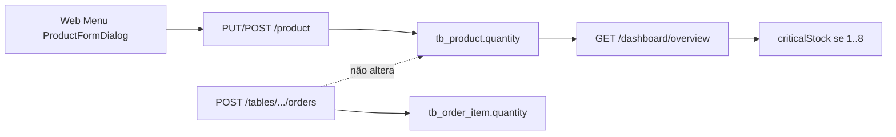

# 13 — Fluxo de estoque

## Veredito

**Não há movimento de estoque na venda.** O briefing (Produto → ItemPedido → quantidade vendida → baixa → inventário) **não está implementado** como fluxo.

O que existe:

- Campo `Product.quantity` (`Long`) em `tb_product`
- CRUD via `ProductService` / `POST|PUT /product/*` (web catálogo)
- Dashboard trata quantidade **> 0 e ≤ 8** como estoque crítico (`DashboardService.LOW_STOCK_MAX = 8`, alerta `LOW_STOCK`)
- Tela web `Inventory.js` é **mock** e **não está montada** no `Dashboard`

## Quando `quantity` muda

Somente no cadastro/edição de produto (`ProductService` copia `productDTO.getQuantity()`).

Não há `setQuantity` decrementando em `OrderService`, `GroupOrderService`, `ComandaAccountService` ou `KitchenService`.

`OrderItem.quantity` é a **quantidade vendida naquele item**, snapshot; não atualiza `Product.quantity`.

## O que não existe

- Baixa na criação do pedido
- Baixa na confirmação/KDS
- Baixa no pagamento/fechamento
- Cancelamento com estorno de estoque
- Devolução
- Ajuste de inventário com histórico
- Reposição como entidade
- Endpoint de inventário
- Android lendo/escrevendo estoque (o `Product.quantity` pode vir no JSON do catálogo, mas não há tela de estoque)

## Diagrama do que o código faz

Status na matriz: **parcial** no backend (campo + alerta), **não implementado** como módulo de inventário, **não montado** na web, **ausente** no Android operacional.
