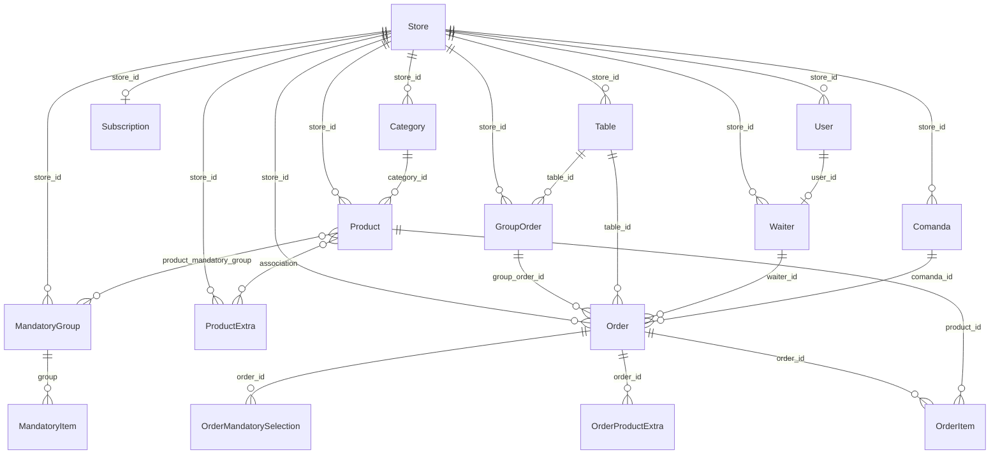

# 15 — Modelo de dados

Schema gerenciado por Hibernate `ddl-auto=update`. Sem Flyway/Liquibase. Banco PostgreSQL, database `weper`.

Campo de tenant: `store_id` (exceto tabelas filhas listadas).

## Diagrama de entidades (nomes reais)

```text
Store (tb_store)
   │
   ├── User (tb_user)                    store 1:N
   │      └── Waiter (tb_waiter)         User 1:1 Waiter (user_id unique)
   │
   ├── Subscription (tb_subscription)    Store 1:1
   │
   ├── Category (tb_category)            store 1:N
   │      └── Product (tb_product)       Category 1:N
   │
   ├── ProductExtra (tb_product_extra)   store 1:N
   │      └── *──* Product               product_extra_association
   │
   ├── MandatoryGroup (tb_mandatory_group)
   │      ├── MandatoryItem (tb_mandatory_item)   Group 1:N  (sem store_id)
   │      └── *──* Product               product_mandatory_group
   │
   ├── Table (tb_table)
   ├── Comanda (tb_comanda)
   │
   ├── GroupOrder (tb_group_order)       Table 1:N (via table_id)
   │      └── Order (tb_order)           GroupOrder 1:N
   │
   └── Order (tb_order)
          ├── OrderItem (tb_order_item)           Order 1:N  (sem store_id)
          ├── *──* Product                        order_product
          ├── OrderProductExtra                   Order 1:N
          └── OrderMandatorySelection             Order 1:N
          ├── Table?  Waiter?  Comanda?
```



## Cardinalidade

| Relação | Tipo |
|---------|------|
| Store 1:N User | `User.store` |
| Store 1:1 Subscription | `Subscription.store` unique |
| Store 1:N Category, Product, Table, Comanda, Waiter, Order, GroupOrder, ProductExtra, MandatoryGroup | `store_id` |
| Category 1:N Product | `Product.category` |
| User 1:1 Waiter | `Waiter.user` unique |
| Table 1:N GroupOrder | `GroupOrder.table` obrigatório |
| GroupOrder 1:N Order | `Order.groupOrder` opcional |
| Table 1:N Order | `Order.table` opcional |
| Waiter 1:N Order | `Order.waiter` opcional |
| Comanda 1:N Order | `Order.comanda` opcional |
| Order 1:N OrderItem | `OrderItem.order` |
| Product 1:N OrderItem | `OrderItem.productId` (Long, não `@ManyToOne`) |
| Order N:N Product | join `order_product` |
| Product N:N ProductExtra | `product_extra_association` |
| Product N:N MandatoryGroup | `product_mandatory_group` |
| MandatoryGroup 1:N MandatoryItem | |

## Tabelas e campos principais

| Tabela | Entidade | Campos relevantes |
|--------|----------|-------------------|
| `tb_store` | `Store` | name, slug unique, responsible_name, email, phone, active, createdAt, updatedAt |
| `tb_user` | `User` | store_id, name, username unique, email unique, password_hash, role, active |
| `tb_subscription` | `Subscription` | store_id unique, plan, price, status, startDate, expiresAt |
| `tb_category` | `Category` | store_id, name, unique (store_id, name), background_color, image TEXT, active, parent_id |
| `tb_product` | `Product` | store_id, name, image TEXT, portion, observation, isAvailable, value, quantity, category_id |
| `tb_product_extra` | `ProductExtra` | store_id + extra |
| `tb_mandatory_group` / `tb_mandatory_item` | grupos obrigatórios | item sem store_id |
| `tb_table` | `Table` | store_id, number, isAvailable, capacity, isCounter, deleted |
| `tb_comanda` | `Comanda` | store_id, number, isAvailable, deleted |
| `tb_waiter` | `Waiter` | store_id, user_id, name, email, isActive, isCounter |
| `tb_group_order` | `GroupOrder` | store_id, table_id, status, totalAmount, paymentMethod, applyServiceTax, discount, createdAt, closedAt |
| `tb_order` | `Order` | store_id, table_id, group_order_id, waiter_id, comanda_id, customerName, observation, isFromTable, status, totalAmount, paymentMethod, closedAt, applyServiceTax, discount, kitchenStatus, kitchen_ready_at |
| `tb_order_item` | `OrderItem` | order_id, product_id, product_name, unit_price, quantity, observation |
| `tb_order_product_extra` | `OrderProductExtra` | order, product, extra, quantity |
| `tb_order_mandatory_selection` | `OrderMandatorySelection` | order, group, item |

## Enums persistidos (STRING)

| Enum | Valores |
|------|---------|
| `Role` | MASTER, SUPER_ADMIN, ADMIN, STORE_ADMIN, WAITER, KITCHEN, CASHIER |
| `OrderStatus` | ACTIVE, CLOSED |
| `KitchenStatus` | NEW, IN_PREPARATION, READY, DELIVERED, FINALIZED |
| `GroupOrderStatus` | ACTIVE, CLOSED |
| `PaymentMethodEnum` | PIX, DEBIT, CREDIT, CASH, VOUCHER, OTHER |
| `SubscriptionPlan` | BASIC, PRO, PREMIUM |
| `SubscriptionStatus` | ACTIVE, PENDING, OVERDUE, BLOCKED, CANCELED |

## O que **não** existe no modelo

- Tabela de pagamentos
- Tabela de movimento de estoque / inventário
- Tabela de turnos (`Shift` é DTO agregado em memória)
- `tenantId` genérico além de `store_id`
- Soft delete uniforme (só Table/Comanda têm `deleted`)
