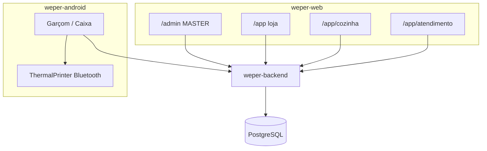

# 16 — Mapa de integrações e dependências

## Topologia

```text
                ┌─────────────────┐
                │     BACKEND     │
                │  Spring / :8080 │
                └────────┬────────┘
                         │
       ┌─────────────────┼──────────────────┐
       │                 │                  │
       ▼                 ▼                  ▼
  WEB /admin         WEB /app            ANDROID
  MASTER             loja                WAITER/CASHIER
                     Caixa + KDS
       │                 │                  │
       └─────────────────┼──────────────────┘
                         │
                         ▼
                    PostgreSQL
```



Web e Android **não** se integram. A impressora é só dispositivo local no Android. Firebase Crashlytics (Android) e Firebase init (web) não fazem parte do fluxo de pedidos.

## Quem depende de quais módulos de API

| Módulo backend | Web admin | Web loja | Web KDS | Web caixa | Android |
|----------------|-----------|----------|---------|-----------|---------|
| `/api/auth/login` | ✅ | ✅ | ✅ | ✅ | ✅ |
| `/api/stores` | ✅ | ❌ | ❌ | ❌ | ❌ |
| `/api/employees` | ❌ | ✅ | ❌ | ❌ | ❌ |
| `/api/waiters` | ❌ | ❌ | ❌ | ❌ | ❌ |
| `/category`, `/product` CRUD | ❌ | ✅ | ❌ | ❌ | leitura + extras |
| `/tables` CRUD | ❌ | ✅ (via atendimento) | ❌ | ✅ | leitura |
| `/comandas` CRUD | ❌ | ✅ | ❌ | ✅ | leitura |
| `POST /tables/{id}/orders` | ❌ | ❌ | ❌ | ❌ | **✅ único criador** |
| GET conta + POST close mesa/comanda | ❌ | ❌ | ❌ | ✅ | ✅ |
| `POST /counter/orders/{id}/close` | ❌ | ❌ | ❌ | ❌ | ✅ |
| `GET /kitchen/orders` | ❌ | ❌ | ✅ | ❌ | ❌ |
| `PATCH kitchen status` | ❌ | ❌ | ✅ | ❌ | ✅ |
| `GET /dashboard/overview` | ❌ | ✅ | ❌ | ❌ | ❌ |
| `GET /home/*` | ❌ | ❌ | ❌ | ❌ | ✅ |
| `GET /order/all` | ❌ | ❌ | ❌ | ❌ | ✅ |

## Integrações externas

| Sistema | Presente? |
|---------|-----------|
| Gateway de pagamento | Não |
| E-mail / SMTP | Não |
| SMS | Não |
| Object storage | Não (imagem TEXT/base64 no JSON) |
| Firebase Auth | Inicializado no web, não usado |
| Firebase Crashlytics | Android sim |
| FCM | Não |
| Impressora térmica | Android Bluetooth ESCPOS |
| OpenAPI/Swagger | Backend local |

## Variáveis de ambiente (nomes)

Backend: `PORT`, `DB_URL`, `DB_USER`, `DB_PASS`, `DDL_OPTION`, `CORS_ALLOWED_ORIGINS`, `CORS_ALLOW_CREDENTIALS`, `JWT_SECRET`, `JWT_EXPIRATION_MS`, `BOOTSTRAP_SUPER_USER`, `BOOTSTRAP_SUPER_PASSWORD`, `DEMO_SEED`.

Web: `REACT_APP_API_BASE_URL`, `REACT_APP_FIREBASE_*`.

Android: `debug.api.url` / `-PdebugApiUrl`; release `BASE_URL` placeholder Render.

## Acoplamento operacional

O estabelecimento só funciona completo se:

1. Master criou a `Store` (web admin)
2. Admin cadastrou catálogo + mesas/comandas + colaboradores com role e senha (web loja)
3. Garçom/caixa com `Waiter` vinculado faz login no Android e lança pedidos
4. Cozinha usa a **mesma API** pela web KDS
5. Caixa fecha na web ou no Android

Se o Android estiver fora: a loja **não lança pedidos de salão** (a web não chama `POST /tables/{id}/orders`).  
Se a web KDS estiver fora: a cozinha não tem board; o garçom ainda vê `GET /home/shift`.  
Se a web caixa estiver fora: o Android ainda fecha mesa/comanda/balcão.
