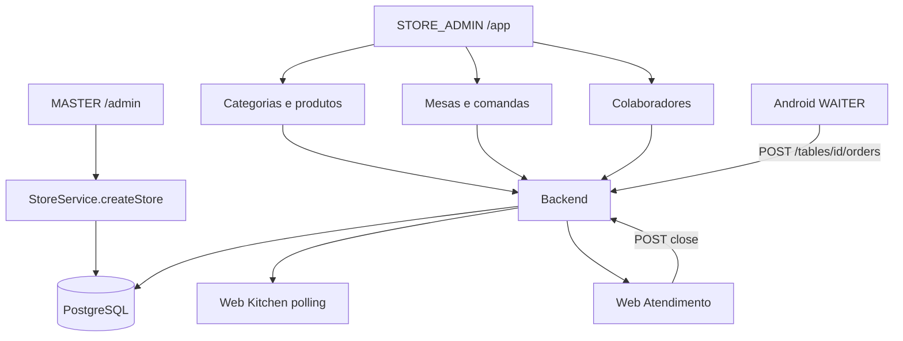
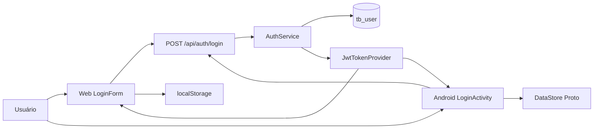
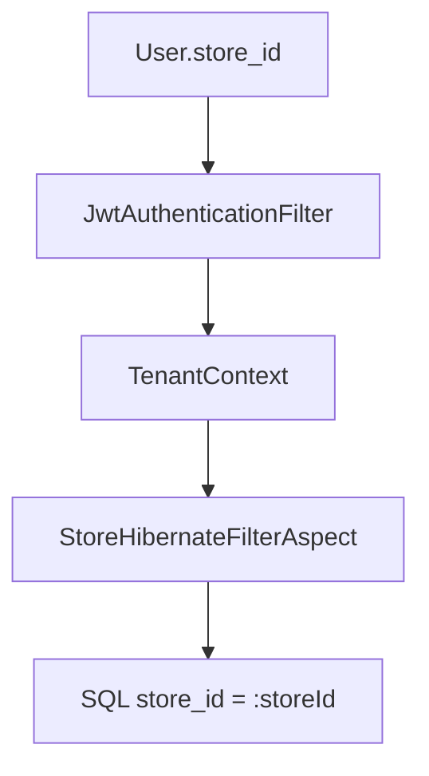

# 18 — Fluxo completo do sistema

Documento principal. Compara o fluxo **esperado** (briefing) com o **código real**. Responde às 20 perguntas de rastreabilidade.

---

## 1. Visão esperada vs realidade

```text
ESPERADO                         REAL NO CÓDIGO
─────────────────────────────────────────────────────────────
MASTER ADMIN                     MASTER/SUPER_ADMIN web /admin
CRIA ESTABELECIMENTO             POST /api/stores → Store + STORE_ADMIN + Subscription
LOJA                             Store (tb_store), tenant = storeId
CADASTRA FUNCIONÁRIOS            POST /api/employees (+ Waiter se WAITER/CASHIER)
CADASTRA CATEGORIAS/PRODUTOS     /category/*  /product/*  (web)
CADASTRA MESAS/COMANDAS          /tables/*  /comandas/*  (web)
GARÇOM Android                   Sim, só WAITER/CASHIER com waiterId
Seleciona estabelecimento        NÃO. storeId vem do User
Mesa / Comanda / Balcão          Sim (balcão e comanda usam tableId 999)
Pedido → Backend → Banco         POST /tables/{id}/orders
COZINHA KDS app                  NÃO. É rota web /app/cozinha + polling 12s
Caixa web fecha                  Sim, mesa e comanda (não balcão)
Estoque na venda                 NÃO
Pagamento gateway                NÃO. Enum no close
```



---

## 2. Jornada completa (código)

### Fase A — Plataforma cria a loja

```text
Usuário MASTER
  → LoginForm → POST /api/auth/login
  → /admin/restaurantes
  → storesService.createStore
  → POST /api/stores
  → StoreController → StoreService.createStore
       tb_store
       tb_user (STORE_ADMIN)
       tb_subscription
```

Credenciais: `adminEmail`/`adminUsername` + `adminPassword` no `CreateStoreRequest`. Role fixa `STORE_ADMIN`.

### Fase B — Loja configura operação

```text
STORE_ADMIN → /app
  Colaboradores → CRUD /api/employees
       role WAITER/CASHIER → WaiterService.ensureForUser → tb_waiter
       role KITCHEN → User sem Waiter (floor operator só WAITER/CASHIER)
  Catálogo → /category + /product
  Mesas → POST /tables/new
  Comandas → POST /comandas/new
```

### Fase C — Garçom vende

```text
Android LoginActivity → POST api/auth/login
  rejeita se não WAITER/CASHIER ou waiterId null
  DataStore: token + storeId + waiterId
MainActivity / HomeFragment
  GET home/options/all  (cards estáticos Balcão, Mesas, Comandas)
  GET home/shift        (polling 12s)

Mesa:    TablesFragment → POST /tables/{id}/orders
Comanda: setComandaInfo → POST /tables/999/orders + comandaId
Balcão:  startCounterSale → POST /tables/999/orders + paymentMethod

OrderService.addNewOrder
  valida store, produtos, mesa/waiter/comanda
  tb_order status=ACTIVE kitchenStatus=NEW
  tb_order_item + extras + mandatory
  mesa/comanda isAvailable=false
  NÃO mexe em Product.quantity
```

### Fase D — Cozinha

```text
KITCHEN → /app/cozinha
  GET /kitchen/orders a cada 12s
  PATCH /kitchen/orders/{id}/status
       NEW | IN_PREPARATION | READY | DELIVERED | FINALIZED
  DELIVERED em balcão standalone → Order CLOSED
```

### Fase E — Caixa

```text
CASHIER → /app/atendimento
  GET /tables/{id}/orders  ou  GET /comandas/{id}/orders
  CheckoutDialog → POST .../close { paymentMethod, applyServiceTax, discount }
  GroupOrder/Orders CLOSED, recurso liberado

Android também fecha (incluindo POST /counter/orders/{id}/close)
```

### Fase F — Gestão

```text
STORE_ADMIN → /app/dashboard
  GET /dashboard/overview?period=
  faturamento, operação, criticalStock (quantity 1..8)
```

---

## 3. Respostas rápidas

1. **Como Web, Android e Backend conversam?**  
   Só REST + JWT. Clientes → Spring → PostgreSQL. Sem canal entre Web e Android.

2. **Quais endpoints existem?**  
   Ver [14-api-map.md](./14-api-map.md) (~60 incluindo deprecated).

3. **Quem usa cada endpoint?**  
   Pedido create = Android. KDS GET = web. Close mesa/comanda = web e Android. Stores = só web master. Waiters API = nenhum cliente.

4. **Login?**  
   `POST /api/auth/login` → BCrypt + loja ativa → JWT. Web `localStorage`; Android DataStore. Sem refresh. Detalhe em [05](./05-authentication-flow.md).

5. **Multi-tenant?**  
   `storeId` do `User.store`, `TenantContext`, Hibernate `storeFilter`. Não vai em header. Riscos em [06](./06-multitenancy-flow.md).

6. **Como um pedido nasce?**  
   Android `CartViewModel.processOrder` → `POST /tables/{tableId}/orders` → `GroupOrderService` + `OrderService.addNewOrder`. [07](./07-order-flow.md).

7. **Como chega na cozinha?**  
   Persistido com `kitchenStatus=NEW`. KDS puxa `GET /kitchen/orders` (poll 12s).

8. **Cozinha altera status?**  
   `PATCH /kitchen/orders/{orderId}/status`. Sem transições obrigatórias.

9. **Caixa recupera o pedido?**  
   `GET /tables/{id}/orders` ou `GET /comandas/{id}/orders`. Balcão: Android/`GET /tables/999/orders` / `GET /order/all`.

10. **Mesa/comanda fechada?**  
    POST close correspondente; `isAvailable=true`; orders CLOSED. [08](./08-table-flow.md) [09](./09-command-flow.md).

11. **Quando o estoque é atualizado?**  
    Só no CRUD de produto. **Nunca** na venda. [13](./13-inventory-flow.md).

12. **Como o pagamento é registrado?**  
    `PaymentMethodEnum` em `Order`/`GroupOrder` no close. Sem tabela Payment. [12](./12-payment-flow.md).

13. **Tabelas?**  
    `tb_store`, `tb_user`, `tb_subscription`, `tb_category`, `tb_product`, `tb_table`, `tb_comanda`, `tb_waiter`, `tb_order`, `tb_order_item`, `tb_group_order`, extras/mandatory. [15](./15-database-model.md).

14–17. **Completas / parciais / quebradas / inexistentes** — matriz abaixo.

18. **Riscos de segurança/multi-tenancy?**  
    Platform admin sem filtro; filhos sem `store_id`; matching textual de comanda; queries nativas. [06](./06-multitenancy-flow.md) [17](./17-problems-and-gaps.md).

19. **Dependências?**  
    Android depende do catálogo/mesas cadastrados na web. KDS e caixa dependem de pedidos do Android. [16](./16-integration-map.md).

20. **Fluxo cadastro → venda?**  
    Fases A–F neste documento.

---

## 4. Matriz de rastreabilidade

Critério: UI → client → endpoint → service → DB → UI.

| Funcionalidade | Web | Android | Backend | Banco | Status |
| -------------- | --- | ------- | ------- | ----- | ------ |
| Login JWT | ✅ | ✅ | ✅ | ✅ `tb_user` | Completo |
| Logout / 401 limpa sessão | ✅ | ✅ | ✅ filtro | — | Completo |
| Refresh token | ❌ | ❌ interceptor não refresha | ❌ | ❌ | Não implementado |
| Forgot password | ⚠️ UI stub | ⚠️ stub | ❌ | ❌ | Incompleto |
| Cadastro de loja | ✅ `/admin` | ❌ | ✅ `StoreService` | ✅ | Completo (só master web) |
| Assinatura / bloqueio 403 | ✅ redirect | ⚠️ (403 genérico) | ✅ filtro | ✅ `tb_subscription` | Parcial |
| Planos master (CRUD API) | ⚠️ telas + mock receita | ❌ | ⚠️ plano no create store | ✅ enum | Parcial |
| Colaboradores | ✅ | ❌ | ✅ `EmployeeService` | ✅ `tb_user` | Completo no web |
| Waiter API dedicada | ❌ | ❌ | ✅ `WaiterController` | ✅ `tb_waiter` | Órfão no cliente |
| Categorias | ✅ CRUD | ✅ leitura | ✅ | ✅ | Completo |
| Produtos | ✅ CRUD | ✅ leitura | ✅ | ✅ | Completo |
| Extras / mandatory | ⚠️ cadastro web pouco mapeado nos services HTTP | ✅ leitura no detalhe | ✅ | ✅ | Parcial |
| Mesas cadastro | ✅ | ❌ leitura | ✅ | ✅ | Completo (cadastro web) |
| Comandas cadastro | ✅ | ❌ leitura | ✅ | ✅ | Completo (cadastro web) |
| Seleção de loja no app | ❌ | ❌ | User já tem store | ✅ | Não existe (por desenho) |
| Pedido mesa | ❌ não cria | ✅ | ✅ | ✅ | Completo só Android→API |
| Pedido comanda | ❌ não cria | ✅ via table 999 | ✅ | ✅ | Completo só Android→API |
| Pedido balcão | ❌ não cria | ✅ | ✅ | ✅ | Completo só Android→API |
| Listar conta mesa | ✅ | ✅ | ✅ | ✅ | Completo |
| Listar conta comanda | ✅ | ✅ | ✅ | ✅ | Completo |
| Fechar mesa | ✅ | ✅ | ✅ | ✅ | Completo |
| Fechar comanda | ✅ | ✅ | ✅ | ✅ | Completo |
| Fechar balcão | ❌ | ✅ | ✅ | ✅ | Parcial (só Android) |
| KDS board | ✅ poll 12s | ❌ | ✅ | ✅ | Completo na web |
| Status cozinha PATCH | ✅ | ✅ | ✅ | ✅ | Completo |
| WebSocket/SSE | ❌ | ❌ | ❌ | — | Não implementado |
| Pagamento PSP | ❌ | ❌ | ❌ | ❌ | Não implementado |
| Registro PaymentMethod | ✅ close | ✅ close | ✅ enum | ✅ colunas | Completo como enum |
| Estoque movimento | ❌ mock | ❌ | ⚠️ campo+alerta | ⚠️ `quantity` | Parcial / incompleto |
| Dashboard loja | ✅ | ❌ | ✅ | ✅ leituras | Completo |
| Dashboard master | ✅ | ❌ | ✅ stores dashboard | ✅ | Parcial (gráfico mock) |
| Relatórios avançados | ❌ | ❌ | ⚠️ overview | — | Parcial |
| Configurações loja | ⚠️ mock não montado | ⚠️ tema local | ❌ | ❌ | Não implementado |
| Impressão térmica | ❌ | ✅ Bluetooth | — | — | Completo local Android |
| Offline / sync | ❌ | ❌ | — | — | Não implementado |
| `POST /order/new` | ❌ | ⚠️ API morta | ❌ deprecated | — | Abandonado |
| Garçom na web | ⚠️ placeholder | — | — | — | Não operacional |

---

## 5. Diagramas Mermaid restantes

### Autenticação



### Multi-tenant



### Web → Backend

```mermaid
flowchart LR
    Login[Login] --> Auth[POST /api/auth/login]
    Master[MasterDashboard] --> Stores[ /api/stores ]
    Emp[Employees] --> E[/api/employees]
    Menu[Menu] --> Cat[/category /product]
    Att[Atendimento] --> T[/tables /comandas]
    Att --> Acc[GET/POST contas]
    Kit[Kitchen] --> K[/kitchen]
    Dash[DashboardGerencial] --> D[/dashboard/overview]
```

### Android → Backend

```mermaid
flowchart LR
    L[LoginActivity] --> Auth[POST api/auth/login]
    H[HomeFragment] --> Home[/home/options/all /home/shift]
    T[TablesFragment] --> TA[GET tables/all]
    C[ComandasFragment] --> CA[GET comandas/all]
    Cart[CartViewModel] --> PO[POST tables/id/orders]
    GO[GroupOrderViewModel] --> CL[POST close]
    GO --> KS[PATCH kitchen status]
    OD[OrderDetailsViewModel] --> CTR[POST counter/orders/id/close]
```

---

## 6. Índice da pasta

| Doc | Tema |
|-----|------|
| [01-system-overview.md](./01-system-overview.md) | Arquitetura geral |
| [02-backend-architecture.md](./02-backend-architecture.md) | Spring |
| [03-web-architecture.md](./03-web-architecture.md) | React |
| [04-android-architecture.md](./04-android-architecture.md) | Kotlin |
| [05-authentication-flow.md](./05-authentication-flow.md) | Login |
| [06-multitenancy-flow.md](./06-multitenancy-flow.md) | storeId |
| [07-order-flow.md](./07-order-flow.md) | Pedido |
| [08-table-flow.md](./08-table-flow.md) | Mesa |
| [09-command-flow.md](./09-command-flow.md) | Comanda |
| [10-counter-flow.md](./10-counter-flow.md) | Balcão |
| [11-kds-flow.md](./11-kds-flow.md) | Cozinha |
| [12-payment-flow.md](./12-payment-flow.md) | Pagamento |
| [13-inventory-flow.md](./13-inventory-flow.md) | Estoque |
| [14-api-map.md](./14-api-map.md) | Endpoints |
| [15-database-model.md](./15-database-model.md) | Tabelas |
| [16-integration-map.md](./16-integration-map.md) | Dependências |
| [17-problems-and-gaps.md](./17-problems-and-gaps.md) | Gaps |

Nenhum código de aplicação foi alterado nesta análise. Apenas estes arquivos de documentação foram criados.
